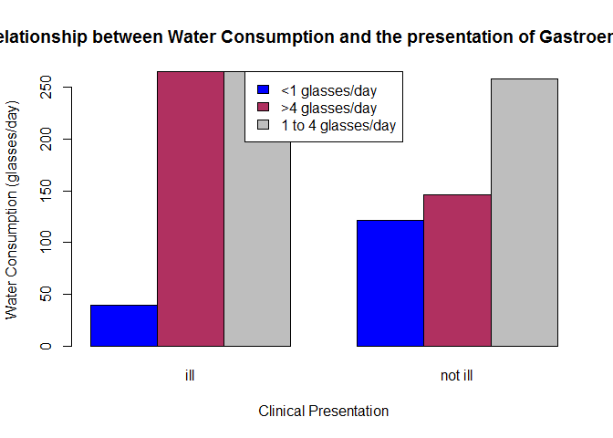
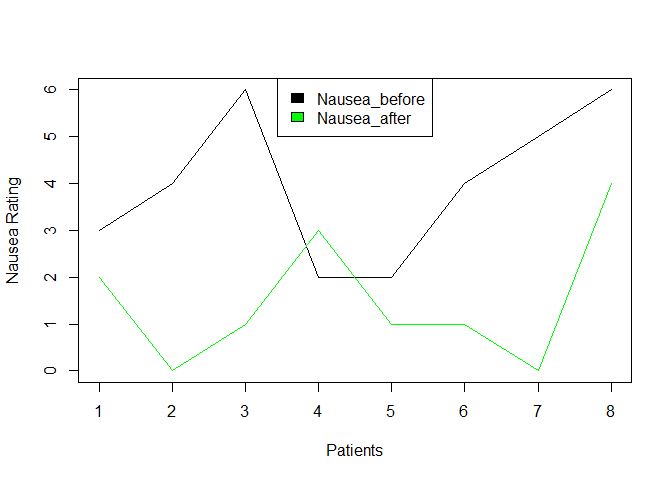

Assignment 5
================
Sihle
25 July 2016

Hello Octocat
-------------

I love Octocat. she's the collest cat in town. 

    ## [1] 11  8

    ## [1] "x1" "x2" "x3" "x4" "y1" "y2" "y3" "y4"

    ##   x1 x2 x3 x4   y1   y2    y3   y4
    ## 1 10 10 10  8 8.04 9.14  7.46 6.58
    ## 2  8  8  8  8 6.95 8.14  6.77 5.76
    ## 3 13 13 13  8 7.58 8.74 12.74 7.71
    ## 4  9  9  9  8 8.81 8.77  7.11 8.84
    ## 5 11 11 11  8 8.33 9.26  7.81 8.47
    ## 6 14 14 14  8 9.96 8.10  8.84 7.04

    ##    x1 x2 x3 x4    y1   y2   y3    y4
    ## 6  14 14 14  8  9.96 8.10 8.84  7.04
    ## 7   6  6  6  8  7.24 6.13 6.08  5.25
    ## 8   4  4  4 19  4.26 3.10 5.39 12.50
    ## 9  12 12 12  8 10.84 9.13 8.15  5.56
    ## 10  7  7  7  8  4.82 7.26 6.42  7.91
    ## 11  5  5  5  8  5.68 4.74 5.73  6.89

    ##        x1             x2             x3             x4    
    ##  Min.   : 4.0   Min.   : 4.0   Min.   : 4.0   Min.   : 8  
    ##  1st Qu.: 6.5   1st Qu.: 6.5   1st Qu.: 6.5   1st Qu.: 8  
    ##  Median : 9.0   Median : 9.0   Median : 9.0   Median : 8  
    ##  Mean   : 9.0   Mean   : 9.0   Mean   : 9.0   Mean   : 9  
    ##  3rd Qu.:11.5   3rd Qu.:11.5   3rd Qu.:11.5   3rd Qu.: 8  
    ##  Max.   :14.0   Max.   :14.0   Max.   :14.0   Max.   :19  
    ##        y1               y2              y3              y4        
    ##  Min.   : 4.260   Min.   :3.100   Min.   : 5.39   Min.   : 5.250  
    ##  1st Qu.: 6.315   1st Qu.:6.695   1st Qu.: 6.25   1st Qu.: 6.170  
    ##  Median : 7.580   Median :8.140   Median : 7.11   Median : 7.040  
    ##  Mean   : 7.501   Mean   :7.501   Mean   : 7.50   Mean   : 7.501  
    ##  3rd Qu.: 8.570   3rd Qu.:8.950   3rd Qu.: 7.98   3rd Qu.: 8.190  
    ##  Max.   :10.840   Max.   :9.260   Max.   :12.74   Max.   :12.500


---------------------------------------------------------------------------

``` r
df <- data.frame('analgesic.csv')
df <- read.csv('analgesic.csv')
```

``` r
dim(df)
```

    ## [1] 40  5

``` r
names(df)
```

    ## [1] "ID"            "Group"         "Measurement_1" "Measurement_2"
    ## [5] "Measurement_3"

``` r
head(df, n=6)
```

    ##   ID     Group Measurement_1 Measurement_2 Measurement_3
    ## 1  1 Analgesic            26            26            21
    ## 2  2 Analgesic            29            26            23
    ## 3  3 Analgesic            24            28            22
    ## 4  4 Analgesic            25            22            24
    ## 5  5 Analgesic            24            28            23
    ## 6  6 Analgesic            22            23            26

``` r
tail(df, n=6)
```

    ##    ID   Group Measurement_1 Measurement_2 Measurement_3
    ## 35 35 Placebo            17            21            15
    ## 36 36 Placebo            19            17            15
    ## 37 37 Placebo            14            19            13
    ## 38 38 Placebo            17            19            13
    ## 39 39 Placebo            11            20            18
    ## 40 40 Placebo            15            18            12

``` r
summary(df)
```

    ##        ID              Group    Measurement_1   Measurement_2 
    ##  Min.   : 1.00   Analgesic:20   Min.   :10.00   Min.   : 8.0  
    ##  1st Qu.:10.75   Placebo  :20   1st Qu.:17.00   1st Qu.:17.0  
    ##  Median :20.50                  Median :20.00   Median :20.0  
    ##  Mean   :20.50                  Mean   :20.12   Mean   :20.7  
    ##  3rd Qu.:30.25                  3rd Qu.:24.00   3rd Qu.:25.0  
    ##  Max.   :40.00                  Max.   :30.00   Max.   :32.0  
    ##  Measurement_3  
    ##  Min.   :12.00  
    ##  1st Qu.:16.00  
    ##  Median :20.50  
    ##  Mean   :20.52  
    ##  3rd Qu.:24.25  
    ##  Max.   :30.00

``` r
library(tidyr)
library(dplyr)
```

    ## 
    ## Attaching package: 'dplyr'

    ## The following objects are masked from 'package:stats':
    ## 
    ##     filter, lag

    ## The following objects are masked from 'package:base':
    ## 
    ##     intersect, setdiff, setequal, union

``` r
df_1 <- gather(df, key=Key, value=Value, Measurement_1, Measurement_2, Measurement_3, -ID)

df_2 <- group_by(df_1, ID, Group)
summarise(df_2, Mean=mean(Value))
```

    ## Source: local data frame [40 x 3]
    ## Groups: ID [?]
    ## 
    ##       ID     Group     Mean
    ##    <int>    <fctr>    <dbl>
    ## 1      1 Analgesic 24.33333
    ## 2      2 Analgesic 26.00000
    ## 3      3 Analgesic 24.66667
    ## 4      4 Analgesic 23.66667
    ## 5      5 Analgesic 25.00000
    ## 6      6 Analgesic 23.66667
    ## 7      7 Analgesic 26.66667
    ## 8      8 Analgesic 23.33333
    ## 9      9 Analgesic 22.66667
    ## 10    10 Analgesic 24.00000
    ## # ... with 30 more rows

Chunk 1
=======

Null hypothesis
---------------

-   The Chicks' weights are dependent on the feed

Alternative Hyphothesis
-----------------------

-   The chicks' weights are not dependent on the feed

``` r
x <- read.csv("chick-weights.csv")
View(x)
boxplot(x$weight~x$feed)
```


``` r
#anova test
 chickanova<-aov(weight~feed, data = x)
 summary(chickanova)
```

    ##             Df Sum Sq Mean Sq F value   Pr(>F)    
    ## feed         5 231129   46226   15.37 5.94e-10 ***
    ## Residuals   65 195556    3009                     
    ## ---
    ## Signif. codes:  0 '***' 0.001 '**' 0.01 '*' 0.05 '.' 0.1 ' ' 1

``` r
#Degrees of freedom and p value
 df = 5
 'p < 0.05'
```

    ## [1] "p < 0.05"

``` r
"Accept null hypothesis"
```

    ## [1] "Accept null hypothesis"

Chunk 2
=======

Null hypothesis
---------------

-   Drinking contaminated water does not cause gastroenteritis

Alternative Hypothesis
----------------------

\*drinking contaminated water causes gastroenteritis

``` r
library(tidyr)
s<- read.csv("gastroenteritis (1).csv")
s1<- xtabs(~Consumption + Outcome, data = s)
s1
```

    ##                     Outcome
    ## Consumption          ill not ill
    ##   < 1 glasses/day     39     121
    ##   > 4 glasses/day    265     146
    ##   1 to 4 glasses/day 265     258

``` r
barplot(s1, beside = TRUE, ylab = "Water Consumption (glasses/day)", xlab = "Clinical Presentation", main = "Relationship between Water Consumption and the presentation of Gastroenteritis", col = c("blue", "maroon", "grey"))
legend("top", c("<1 glasses/day", ">4 glasses/day", "1 to 4 glasses/day"), fill = c("blue", "maroon", "grey"))
```



``` r
#chi squared test
s2<-chisq.test(s1, correct = TRUE)
s2
```

    ## 
    ##  Pearson's Chi-squared test
    ## 
    ## data:  s1
    ## X-squared = 74.925, df = 2, p-value < 2.2e-16

chi squared test assumptions
============================

*two catergorical variables *determine the realationship between two variables\# We reject the null hypothesis because p&lt;0.05

\*We reject the null hypothesis because p&lt;0.05 ---

Chunk 3
=======

Null Hypothesis
---------------

\*Chemotherapy does not cause nausea

Alternative Hypothesis
----------------------

\*Chemotherapy causes nausea

``` r
library(tidyr)
d <- read.csv("nausea.csv")

#The nausea scale ranges from 0 to 6, thereefore the last reading might have been an error. I have changed to to 4 to have it align with the other readings.

d[8,3]=4
d
```

    ##   Patient Nausea_before Nausea_after
    ## 1       1             3            2
    ## 2       2             4            0
    ## 3       3             6            1
    ## 4       4             2            3
    ## 5       5             2            1
    ## 6       6             4            1
    ## 7       7             5            0
    ## 8       8             6            4

``` r
#Plotting the data

plot(d$Nausea_before~d$Patient, type = "l", xlab ="Patients", ylab = "Nausea Rating", ylim= c(0,6))
lines(d$Nausea_after~d$Patient, col= "green")

legend("top", c("Nausea_before", "Nausea_after"), fill = c("black", "green"))
```



``` r
#Wilcox test
wilcox.test(d$Nausea_before, d$Nausea_after, paired = TRUE)
```

    ## Warning in wilcox.test.default(d$Nausea_before, d$Nausea_after, paired =
    ## TRUE): cannot compute exact p-value with ties

    ## 
    ##  Wilcoxon signed rank test with continuity correction
    ## 
    ## data:  d$Nausea_before and d$Nausea_after
    ## V = 34, p-value = 0.02897
    ## alternative hypothesis: true location shift is not equal to 0

Underlying Assumption
---------------------

\*Paired and non-parametric data.

\*p value&lt;0.05, therefore we reject the null hypothesis.
